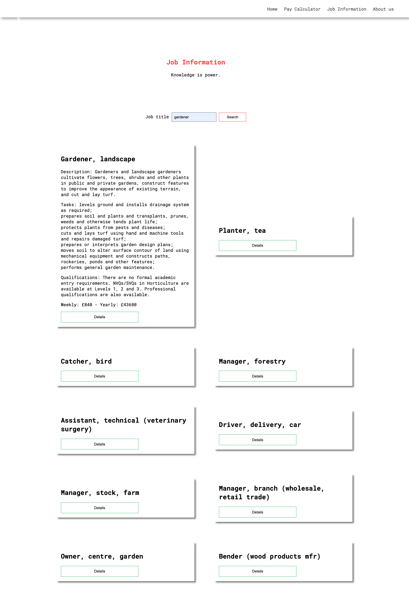

<h1 style="color: #ff474e"> Welcome to Salarty 💼	</h1>

Table of Contents

<ol>
    <li>
        <a href="#aboutTheProject">About the project
    </li>
    <li>
        <a href="#settinUpTheProject">Setting up the project</a>
     </li>
    <li>
        <a href="#aboutTheProject">Landing page</a>
    </li>
    <li>
       <a href="#payCalculator">Pay calculator</a>
    </li>
    <li>
       <a href="#jobInformationPage">Job information page</a>
    </li>
    <li>
       <a href="#aboutUs">About us</a>
    </li>
</ol>

<section id="aboutTheProject">
    <h3>About the project</h3>
    
The project was part of a course 
    work during my second year at university.
    It consist of 4 html pages and serves as a tool to calculate your salary or a way to learn more information about a job position.
    The project is build using only html ,css and a little bit of JavaScript.
    The whole purpose of the project was to gain some experience in working with 3rd part API's and manipulating the DOM structure. During the development of the project I have tried to make use of good practices such as using Semantic HTML and undestandable naming convention.
    

</section>
<section id="settinUpTheProject">
<h3>Setting up the project</h3>

The great thing about this project is that you do not need to set up anything if you want to checkout the project or try to change some thing you can simply clone the repository and give it a try.

</section>
<section id="landingPage">
<h3>Landing Page</h3>

The landing page has the nav bar. One hero section with call to action button that takes the user to the pay calculator.
Some nicely styled service cards and a footer.

</section>

<section id="payCalculator">
<h3>Pay Calculator</h3>

The purpose of this page is to provide the user with the ability to calculator its salary rate by choosing amount of money and a period time for which he/she earns it.

</section>
<section id="jobInformationPage">
<h3>Job Information Page</h3>

For me personally this was the most interesting part of the project.
    I have really learned a lot from this project and it made me realise why front-end developers need frameworks.
    Manipulation the DOM with vanilla javascript is definetly not the best option out there. On the other hand it really help me learn more about event handlers , promises and DOM manipulation.

</section>

<section id="aboutUs">
<h3>About Us Page</h3>

This page is just a basic information about the website with a  design of a contact form.

</section>
